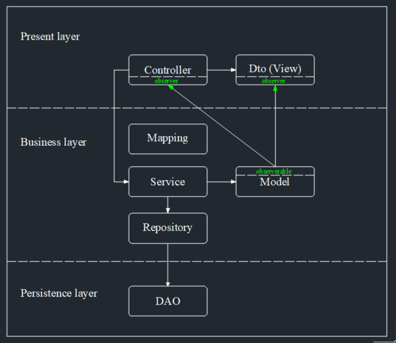

Система управления проектами.
Задание на курсе IT-университета Digital Design по Java-разработке 2023.

Архитектура системы представляет собой трехслойку:

Модуль model содержит классы сущностей(модели) предметной области, также реализующие объектно-реляционное отображением базы данных системы

Модуль service содержит классы реализующие бизнес-логику системы

Модуль repository содержит классы инкапсулирующие доступ к источникам данных

Модуль controller содержит контроллеры обрабатывающие запросы к api

Модуль dto содержит классы служащие для передачи данных между слоями контроллер - модель
